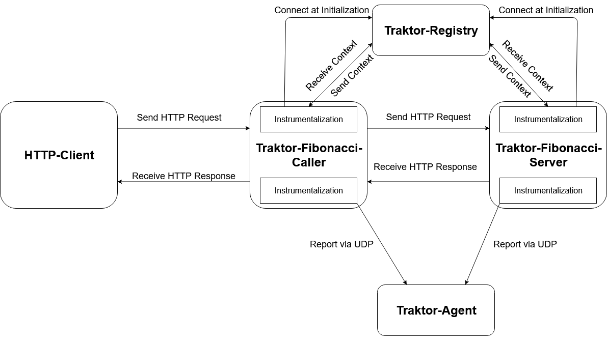

# Traktor Test Enviroment

## Requirements
* Docker

## Usage

Run the Project via:

```
docker-compose up
``` 

### Example Request

* Start the Enviroment
* traktor-fibonacci-server connects to the TraktorRegistry via WebSocket
* Send HTTP JSON to traktor-fibonacci-server with 1 Key:Value pair consisting of a Key named 'N' and a number e.g. with httpie
```
http PUT 172.22.0.4:8084 N:=2
``` 
* Result is the calculated Fibonacci-Number
* TraktorRegistry Propagates Context
* TraktorAgent recieves the SPANS and prints them

## Architecture



## ToDO
* New Insights while implementing Caller:
    * Context Injection
    * Context Extraction
    * WebSocketReceiveResult Bufferhandling
* Thinking about Asynchronous Functions and how to handle them:
    * ReceiveAsync
    * SendAsync
* More Abstraction needed for handling BinaryCarrier and Receive,Send in general
* Add SequenzeDiagramm
* Thinking about WebsocketPackage Interception
* Thinking about WebsocketPackage Rebuilding